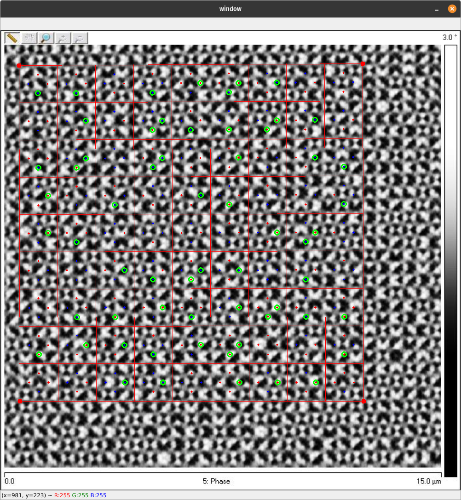
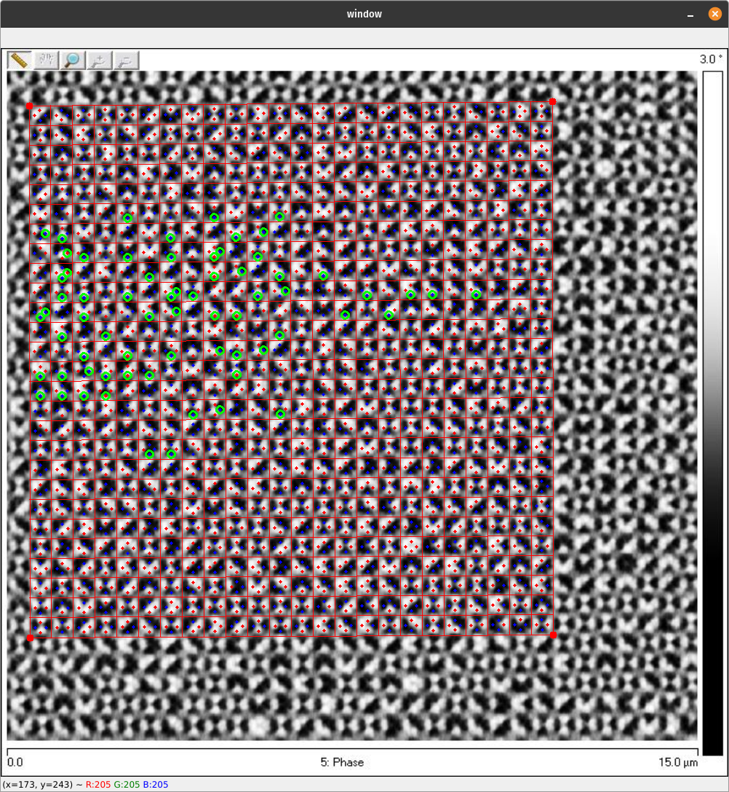
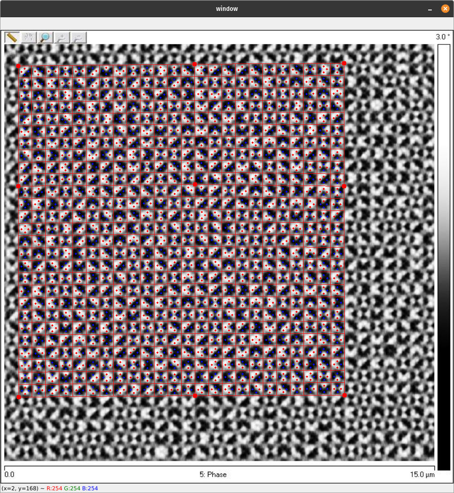
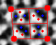

# MFM Image Reader
This repository contains code intended to assist in the conversion from MFM scans to raw data for artificial spin ice. This folder includes the base code for extracting island data from several different lattice types, as well as some example testing images.
\
For anyone working on this code in the future, please feel free to email me (Grant Fitez) at grant.fitez@yale.edu or grantfitez@gmail.com with any questions.

# Setup
**These instructions are primarily intended for linux. If you are using a different operating system, the exact commands may vary but the overall process should look similar.**
1. Clone or download the repository
2. In your terminal navigate into the outermost folder (the one that this README.md file is in).

3. Start the virtual enviroment:
`sudo python3 -m venv env` <br> 
*Note: If you do not wish to use a virtual enviroment skip steps 3 and 4*

4. Activate the virtual enviroment:
`source env/bin/activate`

5. Install the requirements:
`pip install -r requirements.txt`

6. Confirm the program is working by running one (or more) of the example programs
    - `python PerpendicularKagome-Reader.py TestImages/PerpendicularKagome.bmp`
    - `python SantaFe-Reader.py TestImages/SantaFe_Phase.jpg`
    - `python Square-Reader.py TestImages/Square.jpg`
    - `python YShape-Reader.py TestImages/YShape_Phase.jpg`
# Using the Program
The exact controls and functionality of the program can vary between each lattice implementation and the guide here may not be completely accurate for every single program. However, this section should serve as a general overview of how these MFM reader programs are used.

## Overview 
### The Grid
The program will produce a new window which should show the MFM scan image with a grid over top of it. The four corners of this grid can be moved to align it with the area of interest in the MFM image (or the entire image).

### Adding reference points
One of the primary challenges that this program is meant to solve is that slight distortions and stretching in the scans mean that island color cannot be determined simply by sampling at periodic intervals. To solve this, right-clicking at any vertex will create a "reference point" in that location. This point can be drug around to distort the grid in order to 
conform to the geometry of the sample

### Adjusting rows and columns
<span>nodeNetwork.py</span> has built in functionality to add and remove rows and columns to the grid. In all the example implementations, pressing r/e will add/remove a row and c/x will add/remove a column.

### Reference Image
In lattice types with complicated or hard to read geometries (e.g. Santa Fe, Y-shape) it is convenient to provide a secondary reference image to help align the points. In most cases this will be the height image from the MFM scan. This allows the user to align the grid with an easier to read image before switching back to the phase image. Adding a reference image does not have an impact on the program output. Usually it can be toggled by pressing "a".

### Sample Points
Depending on the implementation, you will see a pattern of "sample points" overlayed onto the image. These points are intended align above areas of the image which describe the island layout. Blue points indicate a black sample and red points indicate a white sample. In most lattices with a simple island shape, there will be two sample points on an island: 1 for the black side, 1 for the white side. As a user, it should be your goal to make adjustments to the grid so that all islands are read correctly.

### Errors
For some lattice geometries, it is possible to detect errors automatically. For example, most islands will have a black side and white side so reading 2 white or 2 black means that an error has occured. This will result in a green circle being draw on or near the offending island. Errors do not effect the output of the program; they are merely used as a tool to make sure everything is aligned.

### Manual corrections
Lastly, it is possible for the user to make manual corrections to the sample points before saving. In most implementations shift/ctrl clicking on a sample point will toggle its color between red, blue, and green. Green indicates that the point is unreadable.<br>
**Note: All manually corrections will be reset if the grid is adjusted later. Make sure that manual corrections are the last thing you do before saving the image.**


## Step-by-step guide

1. run `python [yourProgamName].py [mfmImage].jpg`<br>You can optionally add more arguments such as `-a [heightImage].jpg`
2. Align the grid over the area you want to read.<br>

3. Add rows and columns until you have the same number of squares and areas you want to sample. Don't worry about exact alignment at this point.<br>

4. In areas where the grid is misaligned, add additional reference points and drag them to adjust the location of the sample points.<br>

5. After the majority of points have been aligned correctly, manually correct errors and mark points as unreadable if necessary.
6. Close the program (usually by hitting "Enter"). The data should save automatically.


## Structure
The premise of this program is that a movable, stretchable grid can be aligned over top of an MFM phase image in order to sample the image at the correct island locations. All code relating the implementation of this "adjustable grid" is contained in the abstract `NodeNetwork` class inside <span>nodeNetwork.py</span>. `NodeNetwork` is also responsible for determining the island color at each sample point. <br><br>
Each lattice-specific implementation needs to import <span>nodeNetwork.py</span> and declare a new class which inherits from `NodeNetwork`. From here, the program should implement several methods inside the which relate to that specific lattice. See the next section for more details.

# Modification for a new lattice
This section will cover the basic process for creating a program to work with the new lattice. As an example, I will demonstrate with the square lattice.<br>
<br>
All this code is available in <span>docs/exampleImplementation.py</span> 
## 1. Import the relevant libraries
```python
import cv2
import numpy as np
import argparse
from nodeNetwork import *
```


## 2. Set up a way to get the image from the user. 
<br>For this example I will use argparse
```python
parser = argparse.ArgumentParser(description='MFM image analysis')
parser.add_argument('image', metavar='image', type=str, nargs='+',help='Path of image')

args=parser.parse_args()

try:
    image = cv2.imread(args.image[0])
    image = cv2.resize(image, (1000,1000))
except:
    raise FileNotFoundError("File not found")
```


## 3. Extend the NodeNetwork class
```python
class SquareNodeNetwork(NodeNetwork):
    def getSamplePointsFromSquare(self, topLeft, topRight, bottomLeft, bottomRight, row=0, col=0):
        pass#we will fill this in in the next step

    def hasError(self, samplePoints, rowI, vertexI, pointI):
        return False#do this for now

```
The one method that **must** be implemented is `getSamplePointsFromSquare()`. This is what tells the program where to look in the image for the black/white islands. The method `hasError()` must also be implemented but you can just `return False` if you are working with a lattice where there is no way to detect errors or you want to implement it later. However, it is highly recommended that you do implement this method, as it makes the process of using the program significantly easier.

## 4. Implement `getSamplePointsFromSquare()`<br>
This method is given the four corners of a square on the grid and must return where the sample points will be in that square. For this example, I will have users line up the grid with square areas in the sample and each grid box will have 4 sample points. (See below)
<br>

<br>
`getSamplePointsFromSquare()` is also given a `row` and `column` value. In some lattice types, not every grid box will contain the same exact pattern. This allows you to implement additional logic e.g. "`if row%2==0: [etc]`". This is not used in the square lattice.
<br>
<br>
The output of `getSamplePointsFromSquare()` should be an array of `[x,y]` coordinants. If there are no points it should be `[]`, if there is one point it should be `[[x,y]]` and if there are multiple points it should be `[[x1,y1],[x2,y2],etc]`.

### Code:
Don't worry about the specifics of how these points are calculated. This will look completely different for a different lattice type. The method here is just using the four corners to calculate four positions slightly off each edge.

```python
def getSamplePointsFromSquare(self, topLeft, topRight, bottomLeft, bottomRight, row=0, col=0):
        
        shiftConstant=0.25#How far away the sample points are from the edqe of the square 0=right on the edge, 1=on the opposite edge

        #get center of sides of square
        centerTop=[topLeft[0]+(topRight[0]-topLeft[0])/2, topLeft[1]+(topRight[1]-topLeft[1])/2]
        centerLeft=[topLeft[0]+(bottomLeft[0]-topLeft[0])/2, topLeft[1]+(bottomLeft[1]-topLeft[1])/2]
        centerRight=[topRight[0]+(bottomRight[0]-topRight[0])/2, topRight[1]+(bottomRight[1]-topRight[1])/2]
        centerBottom=[bottomLeft[0]+(bottomRight[0]-bottomLeft[0])/2, bottomLeft[1]+(bottomRight[1]-bottomLeft[1])/2]

        #square width and height
        width=(centerRight[0]-centerLeft[0])
        height=(centerBottom[1]-centerTop[1])

        #sample points are stored as [x,y]
        topSamplePoint=[centerTop[0],centerTop[1]+height*shiftConstant]
        leftSamplePoint=[centerLeft[0]+width*shiftConstant,centerLeft[1]]
        rightSamplePoint=[centerRight[0]-width*shiftConstant,centerRight[1]]
        bottomSamplePoint=[centerBottom[0], centerBottom[1]-height*shiftConstant]

        #return the four sample points in this square
        fourSamplePoints=[topSamplePoint,leftSamplePoint,rightSamplePoint,bottomSamplePoint]
        return fourSamplePoints
```

## 5. (Optional) Implement `hasError()`
<br>
This method  is given an array of all the samplePoints, as well as the current row, column(vertex), and point index within that cell. It must return `True` or `False` depending on whether an error is detected in that cell.
<br><br>
For this example, I will take advantage of the fact that adjacent cells must be opposite colors. If a point is the same color as the adjacent cell, it is an error.
<br><br>

*Note about indexing: The third dimension in the `samplePoints` array will be in the same order as it was specified in the `getSamplePointsFromSquare()` method. The fourth dimension will be `[x,y,color]`.*

```python
def hasError(self, samplePoints, rowI, vertexI, pointI):

        #only look at the right and bottom sample points
        if pointI==0 or pointI==1:
            return False

        #get the current row and grid cell
        row = samplePoints[rowI]
        vertex=row[vertexI]

        if pointI==2:#if we are on the right side of the cell

            #if this is not the last cell in the row, check that the cell to the right has the opposite color
            if vertexI < len(row)-1:
                
                #if the colors are the same, this is the error
                if(vertex[2][2] == row[vertexI+1][1][2]):
                    return True
                    
        #same process as above but for the bottom point
        if pointI==3:
            if rowI < len(samplePoints)-1:
                if(vertex[3][2] == samplePoints[rowI+1][vertexI][0][2]):
                    return True
        
        #false by default
        return False
```
## 6. Instantiate the class and create a `show()` function
```python
#This specifies the four corners of the grid, the # of rows and columns, and the MFM image it is reading.
n=SquareNodeNetwork(Node(10,10),Node(800,10),Node(30,800),Node(700,700),10,10,image)

def show():
    imWidth=1000;
    imHeight=1000;

    outputImage=image.copy()
    n.draw(outputImage)#draw the grid over the image
    cv2.imshow("window",outputImage)
```

## 7. Attach some mouse controls
```python
def mouse_event(event, x, y,flags, param):

    #add a reference point on right click
    if event == cv2.EVENT_RBUTTONDOWN:
        n.splitAtClosestPoint(x,y)
    
    #select a point for dragging on left click
    elif event ==cv2.EVENT_LBUTTONDOWN:
        n.selectNearestFixedPoint(x,y)
        n.dragging=True
    
    #update dragging
    elif event==cv2.EVENT_MOUSEMOVE:
        n.updateDragging(x,y)

    #stop dragging on mouse up
    elif event==cv2.EVENT_LBUTTONUP:
        n.dragging=False
        n.setSamplePoints()

    show()

show();
cv2.setMouseCallback('window', mouse_event)
```
## 8. Add keyboard controls
This will act as both the keyboard controls and the main loop.
```python
while True:
    key=cv2.waitKey(0)
    if(key==ord("\r")):
        break;
    elif(key==ord("r")):
        n.addRow()
    elif(key==ord("e")):
        n.removeRow()
    elif(key==ord("c")):
        n.addCol()
    elif(key==ord("x")):
        n.removeCol()
    
    show()
```

## 9. End the program and save.
```python
with open('output.csv', 'w') as file:
    file.write(n.dataAsString())

outputImage=np.zeros((1000,1000,3), np.uint8)
outputImage[:,:]=(127,127,127)
n.drawData(outputImage)
cv2.imwrite("output.jpg", np.float32(outputImage));

cv2.destroyAllWindows()
```

## 10. Other methods you might want to implement
<br>
These methods are all optional but will likely make using the program easier.

-  `hasError()`: If you haven't done this already
- `drawData()`: Specify a nice-looking output image format
- `dataAsString()`: Change how the data is written to the file. For example, this basic program will include both halves of every island (in a weird format). You would likely want to modify this so that it only includes information about each island once. (See the example SquareLattice program for more details).
- `correctError()`: An experimental method that would allow the lattice to correct errors automatically.


# To Do
- Put a border around the images to make dragging points easier
- Add buttons controls
- Save manual corrections, even after grid is adjusted


